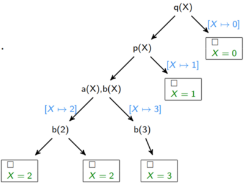

# Session 3

## Let's recap

Before digging in the topics of this session, remember:

- Prolog works by answering queries with respect to a knowledge base
- A Prolog knowledge (or database) comprises clausules that are either rules or facts
- Rules introduce new possible queries
- Facts lead to positive answers
- Non defined knowledge or a piece of information that can not be deduced returns false
- A query with variables for which Prolog returns a positive answer, will also instantiate the
  variable with values that make the query true

## Search Tree

Prolog’s backbone is based on a depth-first search strategy that operates on facts and rules
declared in a database. This sounds harmless, but it is not always straightforward to predict how a Prolog program behaves
in response to a certain query given to it. The best way to find out how Prolog reacts to a query, 
given a certain knowledge base, is to draw a search tree.
 
A search tree shows the way Prolog finds an answer to a query. It shows all the steps
of reasoning to come to an answer, so you may also call it a *proof tree*, using more logical
terminology.

### A first example

Definition of the base knowledge.

```prolog
q(X) :- p(X).
q(0).

p(X) :- a(X), b(X).
p(1).

a(2).
a(3).

b(2).
b(2).
b(3).
```

Let's see how the search tree is generated for the query:

```prolog
?- q(X).
```

The corresponding search tree.



The solutions are enumerated from the left to the right. Hence the solutions are `X=2, X=2, X=3, X=1, X=0`.

### A second example

Do you rememeber de predicate `member`?

```prolog
member(X,[X|_]).
member(X,[_|L]) :- member(X,L).
```
Let's see how the search tree is generated for the query:

```prolog
member(X,[a,b,c]).
```

The corresponding search tree.

```text
 [member(X,[a,b,c])]
      /     \
 X=a /       \ X=X'
    /         \
  []      [member(X',[b,c])]
               /     \
        X'= b /       \ X'= X'' 7
             /         \
           []    [member(X'',[c])]
                      /     \
              X''= c /       \ X''=X'''
                    /         \
                  []     [member(X''',[])]
                             /     \   
                            /       \
                          fail     fail 
```

Sometimes variables need to be renamed when drawing a search tree. This is required when there is a variable occuring 
in a query that is also used in the rule. In the tree above the renaming is represented as  `X', X''`. 
However, you could also chose `X1, X2` or other variables renaming method.

This query has tree solutions. `X=a, X=b` (because `X=X'` and `X'=b`), and `X=c` (because `X'=X''` and `X''=c`).


http://cs.uns.edu.ar/~grs/InteligenciaArtificial/Programacion%20en%20PROLOG(2)-2009-ByN.pdf

https://arxiv.org/pdf/2001.08133.pdf#:~:text=A%20search%20tree%20shows%20the,tree%2C%20using%20more%20logical%20terminology.

diagrams.net
